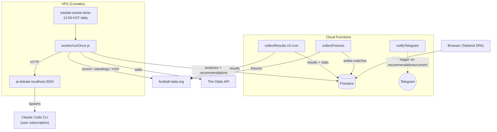

# TotoLab

AI-powered EPL betting analysis — value picks updated daily.

---

## Who is this for?

**Target user:** EPL followers who place occasional bets and want a data edge without hours of research.

**Problem:** Casual bettors rely on gut feel or mainstream tipsters, both of which ignore expected value. TotoLab calculates edge over the de-vigged sharp book (Pinnacle / Smarkets / Betfair) and only flags picks where the model's probability beats the fair probability by at least 5%.

---

## Features

### AI Analysis
- Claude Sonnet analyses every EPL fixture inside the next 24h window, re-running daily so each pass picks up fresh injury, odds, and form data
- Factors in recent form, head-to-head, rest days, rotation risk, and live-fetched injuries
- Outputs 1X2 + Over/Under probabilities, EV %, edge % (vs. de-vigged sharp book), and a confidence score
- Bilingual reasoning (English + Korean) on each match card

### Value Pick Engine
- Filters by configurable thresholds (Edge ≥ 5% on fair price, Confidence ≥ 50)
- Up to 3 strong picks plus a secondary tier (Confidence 40–49)
- Acca odds calculated when ≥ 2 picks pass

### Track Record Dashboard
- Win rate, P&L (£10 flat stake), and ROI tracked automatically
- Breakdown by pick type (Home Win, Draw, Away Win, Over, Under)

### Telegram Alerts
- Push notification when a new set of value picks is published (Firestore trigger)

### Automated Pipeline
- `collectFixtures` — daily 06:00 KST, pulls next 7 days from football-data.org
- `totolab-worker.timer` — daily 12:00 KST on the VPS, re-analyzes every match in the next 24h
- `collectResults` — daily 09:00 KST + same-night Sat/Sun 23:00 KST, reconciles finished matches

---

## Setup

### Prerequisites

- Node.js 22+
- Firebase CLI: `npm install -g firebase-tools`
- A Firebase project with Firestore and Hosting enabled
- API keys: `FOOTBALL_DATA_TOKEN`, `ODDS_API_KEY`
- A host running [ai-debate](https://github.com/.../ai-debate) on `localhost:3000` (the worker calls it for AI analysis — Claude Code CLI under the user's subscription, so no Anthropic API key required)

### Install and run locally

```bash
# Clone
git clone https://github.com/kpeninsula84-ship-it/toto-lab.git
cd toto-lab

# Install Cloud Functions deps
cd functions && npm install && cd ..

# Install worker deps
cd worker && npm install && cd ..

# functions/.env
# FOOTBALL_DATA_TOKEN=...
# ADMIN_TOKEN=...

# worker/.env
# FOOTBALL_DATA_TOKEN=...
# ODDS_API_KEY=...
# AI_DEBATE_URL=http://localhost:3000

# Local emulators (Functions + Firestore)
firebase emulators:start

# One-shot worker run (analysis only)
cd worker
node runOnce.js          # default 24h window
node runOnce.js 48       # one-off wider sweep
```

### Deploy

```bash
firebase deploy
```

Worker runs on a VPS, not Cloud Functions. See [`infra/README.md`](infra/README.md) for the systemd unit + deploy script.

### Manual operations

All HTTP triggers require an `x-admin-token` header matching the `ADMIN_TOKEN` env var on the deployed Functions.

```bash
# Force result collection
curl -H "x-admin-token: $ADMIN_TOKEN" \
  https://asia-northeast3-toto-lab.cloudfunctions.net/collectResultsManual
```

---

## Architecture



| Layer | Role |
|---|---|
| Firebase Hosting | Static SPA (`index.html` + Tailwind CDN) |
| Firestore | Matches, picks, stats, recommendations |
| Cloud Functions | Fixture cron, result cron, Telegram notifier |
| VPS systemd | Daily AI analysis (24h window) |
| ai-debate bridge | Claude Code CLI under user subscription |
| football-data.org | Fixtures, results, standings, recent matches, H2H |
| The Odds API | Live bookmaker odds (1X2 + totals) |

---

## Roadmap

```
Phase 1 ✅                  Phase 2 🔄                  Phase 3 🔲
──────────────────          ──────────────────          ──────────────────
✅ EPL fixture analysis     ✅ Telegram alerts           🔲 User accounts
✅ Value pick engine        🔄 Historical pick archive   🔲 Custom thresholds
✅ Track record stats       🔲 Multi-league support      🔲 Mobile PWA
✅ De-vigged fair edge      🔲 Confidence calibration    🔲 Home screen widget
✅ Bilingual reasoning      🔲 Per-run failure alert
```

| Phase | Status | Target |
|---|---|---|
| Phase 1 — Core EPL analysis | Complete | 2025 Q4 |
| Phase 2 — Alerts & history | In progress | 2026 Q2 |
| Phase 3 — User features | Planned | 2026 Q3 |

---

## License

MIT
