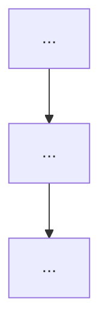

# [PROJECT_NAME]

One-line description of what this project does.

---

## Who is this for?

**Target user:** ...

**Problem:** ...

---

## Features

### Category 1
- Feature A
- Feature B

### Category 2
- Feature C
- Feature D

---

## Screenshots

> Coming soon.

---

## Setup

### Prerequisites
- ...

### Install and run

```bash
# Clone
git clone https://github.com/YOUR_ORG/YOUR_REPO.git
cd YOUR_REPO

# Install dependencies
...

# Run
...
```

---

## Roadmap

```
Phase 1                     Phase 2                     Phase 3
───────────────             ───────────────             ───────────────
🔲 ...                      🔲 ...                      🔲 ...
```

| Phase | Status | Target |
|---|---|---|
| Phase 1 | In progress | ... |
| Phase 2 | Planned | ... |
| Phase 3 | Planned | ... |

---

## Architecture



| Layer | Role |
|---|---|
| | |

