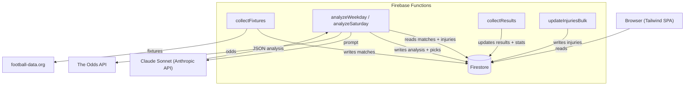

# TotoLab

AI-powered EPL betting analysis — value picks updated daily.

---

## Who is this for?

**Target user:** EPL followers who place occasional bets and want a data edge without hours of research.

**Problem:** Casual bettors rely on gut feel or mainstream tipsters, both of which ignore expected value. TotoLab calculates edge over bookmaker odds and only flags picks where the model's probability beats the implied probability by at least 5%.

---

## Features

### AI Analysis
- Claude Sonnet analyses every upcoming EPL fixture (~12–36 h before kickoff)
- Factors in recent form, head-to-head, rest days, rotation risk, and injuries
- Outputs 1X2 + Over/Under probabilities (line per match, e.g. 2.5 or 3.5), EV %, edge %, and a confidence score

### Value Pick Engine
- Filters picks by configurable thresholds (Edge ≥ 5%, Confidence ≥ 50)
- Shows up to 3 picks per round with a calculated acca/singles recommendation

### Track Record Dashboard
- Win rate, P&L (£10 flat stake), and ROI tracked automatically
- Breakdown by pick type (Home Win, Draw, Away Win, Over/Under)

### Injury & Suspension Tracking
- Weekly manual upload via `updateInjuriesBulk` endpoint
- Injury data injected into Claude prompts for context-aware analysis

### Automated Pipeline
- `collectFixtures` — daily fixture sync from football-data.org
- `analyzeWeekday` — Mon–Fri 12:00 KST, covers next 24 h
- `analyzeSaturday` — Sat 12:00 KST, covers next 48 h (Sat evening + all of Sun)
- `collectResults` — daily 09:00 KST, post-match result collection + stats update

---

## Screenshots

> Coming soon.

---

## Setup

### Prerequisites

- Node.js 22+
- Firebase CLI: `npm install -g firebase-tools`
- A Firebase project with Firestore and Hosting enabled
- API keys: `ANTHROPIC_API_KEY`, `FOOTBALL_DATA_TOKEN`, `ODDS_API_KEY`

### Install and run locally

```bash
# Clone
git clone https://github.com/kpeninsula84-ship-it/toto-lab.git
cd toto-lab

# Install function dependencies
cd functions && npm install && cd ..

# Create functions/.env with your API keys:
# ANTHROPIC_API_KEY=...
# FOOTBALL_DATA_TOKEN=...
# ODDS_API_KEY=...

# Run Firebase emulators
firebase emulators:start
```

### Deploy

```bash
firebase deploy
```

### Manual operations

```bash
# Force re-analysis of upcoming fixtures (within 36 h)
curl https://asia-northeast3-toto-lab.cloudfunctions.net/reanalyzeUpcomingManual

# Upload injury data
curl -X POST -H "Content-Type: application/json" \
  --data "@injuries-payload.json" \
  https://asia-northeast3-toto-lab.cloudfunctions.net/updateInjuriesBulk
```

---

## Roadmap

```
Phase 1 ✅                  Phase 2 🔄                  Phase 3 🔲
──────────────────          ──────────────────          ──────────────────
✅ EPL fixture analysis     🔄 Multi-league support      🔲 User accounts
✅ Value pick engine        🔲 Telegram/email alerts     🔲 Custom thresholds
✅ Track record stats       🔲 Historical pick archive   🔲 Mobile PWA
✅ Injury data pipeline     🔲 Confidence calibration    🔲 Home screen widget
```

| Phase | Status | Target |
|---|---|---|
| Phase 1 — Core EPL analysis | Complete | 2025 Q4 |
| Phase 2 — Alerts & history | In progress | 2026 Q2 |
| Phase 3 — User features | Planned | 2026 Q3 |

---

## Architecture



| Layer | Role |
|---|---|
| Firebase Hosting | Static SPA (index.html + Tailwind CDN) |
| Firestore | Matches, picks, stats, injuries |
| Firebase Functions | Scheduled jobs + HTTP endpoints |
| Claude Sonnet | Per-fixture AI analysis |
| football-data.org | Fixtures, results, standings, H2H |
| The Odds API | Live bookmaker odds |

---

## License

MIT
